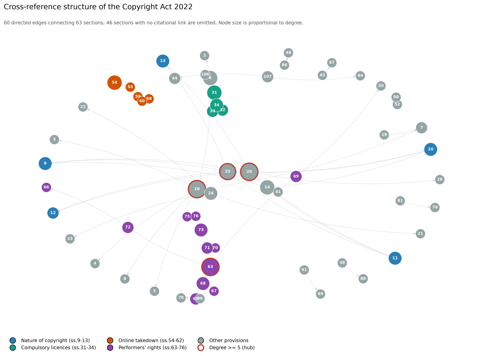

NaijaCopyBench: An Empirical Benchmark for Statutory Compliance, Cross-Reference Topology, and Jurisdictional Displacement in Legal AI
NaijaCopyBench is an evaluation benchmark and auditing framework built to test whether Large Language Models (LLMs) adhere to sovereign domestic legislation or suffer from statutory hallucination and jurisdictional displacement. Grounded in the Nigerian Copyright Act 2022 (NCA 2022), the benchmark departs from unstructured "LLM-as-a-judge" heuristics by framing statutory verification as a decidable graph traversal problem, evaluating zero-shot baseline inference, parameter-efficient fine-tuning (PEFT/QLoRA), and retrieval-augmented generation (RAG) against a deterministic statutory oracle.

Table of Contents
Core Empirical Discoveries
Methodology & System Architecture
Statutory Corpus & Topological Graph
Experimental Arms
Evaluation Metrics (M1–M4)
Repository Structure
Installation & Environment Setup
Reproducing Evaluations & Bootstrapping
Citation

Core Empirical Discoveries
The Divergence Breakdown: Base language models (both small-scale open weights and frontier closed APIs) exhibit a near-complete breakdown on provisions where Nigerian law departs from Western defaults. On 45 divergence queries, both zero-shot models scored 0.0% citation accuracy.
Fabrication Trumps Displacement (H1): Models prompted on sovereign law do not primarily commit explicit foreign legal transplantation (e.g., citing US 17 U.S.C. § 512 or UK CDPA 1988). Instead, they fabricate domestic-sounding statutory citations and subsections, confabulating non-existent rules that mimic local legislative structure. Prompt-level jurisdictional naming halves explicit displacement (from 15.6% to 8.9%).
Fine-Tuning Memorizes Rather than Generalizes (H2): While QLoRA fine-tuning raises in-distribution citation accuracy from 4.8% to 32.5%, performance collapses back to baseline (4.8%) on held-out statutory sections (p<0.05, difference interval [+15.0,+39.0] percentage points excluding zero). Fine-tuning installs question-provision memorization rather than systemic structural understanding.
Downstream Accuracy is a Retrieval-Recall Function (H3): In statutory RAG pipelines, downstream legal reasoning is rarely the bottleneck. When the gold statutory provision is present in the retrieval context, the frontier model achieves 83%–100% accuracy across all task categories. When the governing provision is missed, accuracy falls to 0%–14%.

Methodology & System Architecture

The benchmark consists of an end-to-end statutory extraction, query annotation, multi-arm execution, and bootstrap-verified evaluation workflow.

Figure 1: End-to-end Methodology Workflow across Corpus Preprocessing, Dual-Annotator Benchmark Construction, and Experimental Model Execution Arms.

Statutory Corpus & Topological Graph
The corpus is built directly from a write-once, frozen scan of the Nigerian Copyright Act 2022 (Act No. 2, enacted March 17, 2023).

 Figure 2: Cross-reference structure of the Copyright Act 2022. 60 directed edges connecting 63 sections (46 sections with no citational link are omitted). Node size is proportional to degree; red rings mark major hubs

Experimental Arms
Models were evaluated under greedy decoding and fixed system prompts across four experimental conditions:

Arm A1 (Zero-Shot Baseline): Qwen2.5-3B-Instruct zero-shot.
Arm A2 (Supervised QLoRA): Qwen2.5-3B-Instruct fine-tuned via QLoRA on 967 statutory QA pairs, with 10 sections held out.
Arm A3 (Frontier Base LLM): Version-pinned gpt-4o-mini-2024-07-18 zero-shot.
Arm A5 (Dense RAG): gpt-4o-mini-2024-07-18 supplied with k retrieved chunks via bge-small-en-v1.5 dense embeddings indexed in FAISS.

Evaluation Metrics (M1–M4)

Figure 3: Multi-Metric Evaluation Architecture mapping model outputs against statutory ground-truth oracles to produce bootstrapped confidence intervals.

M1 Citation Fabrication Rate: The share of model citations that do not exist in the 109 sections of the Act, categorized by fabrication tier (non-existent section, lettered section, invalid subsection, invalid paragraph, non-existent entity).

M2 Citation Accuracy: The share of responses correctly citing the governing statutory provision against gold_180.jsonl (N=145, Category E excluded). Evaluated at coarse (section-level) and strict (subsection-level) granularities.

M3 Jurisdictional Displacement Rate: The rate at which foreign legal quantities (e.g., US 14-day counter-notice vs. Nigerian 7-day rule) or legal terminology (e.g., "safe harbor", "fair use") replace Nigerian provisions on Category C items.

M4 Propositional Factuality: Sampled fine-grained claim decomposition (N=611 assertions) scoring claims as Supported (S), Not Supported (N), or Contradicted (C) by the Act.

Repository Structure
naijacopybench/
├── data/
│   ├── act/
│   │   └── raw/CopyrightAct2022.txt       # Frozen, write-once statutory text scan
│   ├── derived/
│   │   ├── arrangement_titles.json        # Section headers across all 109 sections
│   │   ├── chunk_emb.npy                  # 384-d dense embeddings (272 chunks)
│   │   ├── chunks.faiss                   # FAISS IndexFlatIP vector index
│   │   ├── chunks.jsonl                   # 350-word bounded statutory chunks
│   │   ├── section_map.json               # Full hierarchical structural parse
│   │   └── xrefs.json                     # 60-edge statutory directed dependency graph
│   └── eval/
│       ├── benchmark_180.jsonl            # 180 evaluation query items
│       ├── cat[A-F]_internal.jsonl        # Categorical benchmark metadata
│       └── gold_180.jsonl                 # Adjudicated gold legal provisions
├── docs/
│   ├── thesis/
│   │   ├── ch3_methodology_notes.md       # Pipeline engineering & design decisions
│   │   └── ch4_results_notes.md           # Formal empirical results & bootstrap stats
│   ├── ERRATA.md                          # Frozen OCR correction register
│   └── SOURCE.md                          # Source scan provenance and SHA-256 hashes
├── figures/
│   ├── methodology_workflow.png           # End-to-end methodology process diagram
│   ├── evaluation_workflow.png            # Multi-metric evaluation workflow diagram
│   └── xref_graph.jpg                     # Cross-reference topology network graph
├── results/                               # Scored JSONL outputs & bootstrap distributions
├── runs/                                  # Raw model response traces (A1, A2, A3, A5)
├── src/
│   ├── score/
│   │   ├── metrics_citation.py            # M1 validity & M2 accuracy scoring oracles
│   │   ├── metrics_jurisdiction.py        # M3 quantity and displacement logic
│   │   └── parse_gold.py                  # Gold provision parser & range expander
│   └── build/                             # Parsing, graph building, and index scripts
├── a5_recall_vs_accuracy.py               # H3: Retrieval recall vs. downstream accuracy
├── bootstrap_m1.py                        # Item-level percentile bootstrap for Metric M1
├── bootstrap_m2.py                        # Item-level percentile bootstrap for Metric M2
├── compute_kappa.py                       # Inter-annotator agreement (Cohen's kappa)
├── heldout_probe.py                       # H2: Fine-tuning memorization analysis
├── score_m1_all.py                        # Complete M1 evaluation runner
├── score_m2_180.py                        # Complete M2 evaluation runner
├── score_m3_markers.py                    # Complete M3 displacement runner
├── score_m4.py                            # Complete M4 propositional factuality runner
└── requirements.txt                       # Python dependencies

Installation & Environment Setup
Prerequisites
Python 3.10+
CUDA-compatible GPU (recommended for local Qwen evaluation)

Bash
git clone https://github.com/your-username/naijacopybench.git
cd naijacopybench

python -m venv .venv
source .venv/bin/activate  # On Windows: .venv\Scripts\activate

pip install -r requirements.txt

Reproducing Evaluations & Bootstrapping
1. Inter-Annotator Agreement (Cohen's Kappa)
Evaluate pre-adjudication consistency across annotators:

Bash
python compute_kappa.py

2. Metric M1: Citation Fabrication Rate
Run the statutory validator over all model runs and generate item-level bootstrap confidence intervals:

Bash
python score_m1_all.py
python bootstrap_m1.py

3. Metric M2: Citation Accuracy Oracle
Score model outputs against the decidable statutory oracle (gold_180.jsonl):

Bash
python score_m2_180.py
python bootstrap_m2.py

4. Auditing Jurisdictional Displacement (M3)
Detect US/UK doctrinal substitution across Category C items:

Bash
python score_m3_markers.py

5. Evaluating the Retrieval Bottleneck (H3)
Analyze downstream accuracy conditioned on whether the gold provision was present in retrieved context:

Bash
python a5_recall_vs_accuracy.py

6. Evaluating Adapter Memorization (H2)
Audit fine-tuning performance across trained versus held-out statutory sections:
Bash
python heldout_probe.py

Citation
Code snippet
@misc{udome2026naijacopybench,
  author       = {Udome, Ochade},
  title        = {NaijaCopyBench: An Empirical Benchmark for Statutory Compliance, Cross-Reference Topology, and Jurisdictional Displacement in Legal AI},
  year         = {2026},
  publisher    = {GitHub},
  howpublished = {\url{https://github.com/ochade/naijacopybench}},
  note         = {M.Sc. Data Science Thesis, Pan-Atlantic University}
}

 

